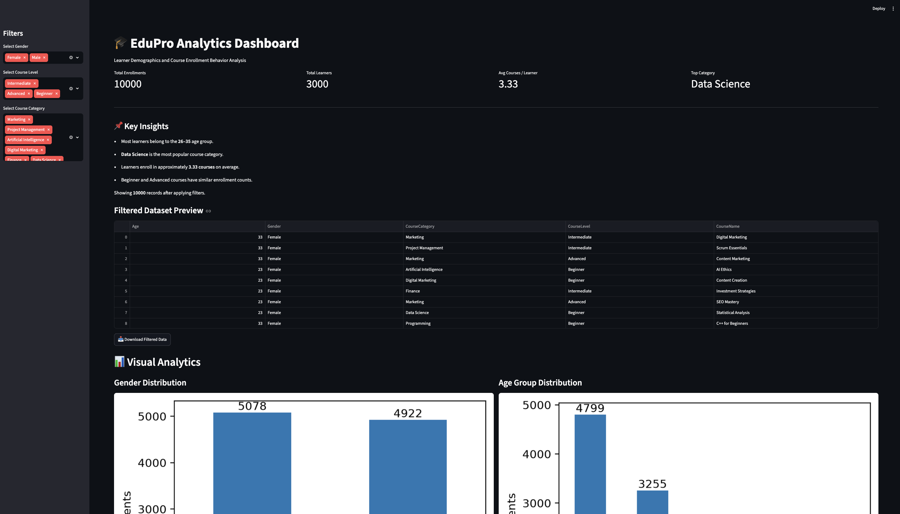

# 🎓 EduPro Analytics Dashboard


## Project Overview


The EduPro Analytics Dashboard is an interactive data analytics project developed using Python and Streamlit. It helps analyze learner demographics, course enrollment trends, and course popularity using an educational platform dataset.


The dashboard allows users to filter data by gender, course level, and course category to explore different insights.


---


## Features


- Interactive dashboard using Streamlit

- Sidebar filters for data exploration

- Key Performance Indicators (KPIs)

- Learner demographic analysis

- Age group distribution

- Gender-wise enrollment analysis

- Top 10 course categories

- Course level popularity

- Dataset preview

- Download filtered dataset


---


## Technologies Used


- Python

- Pandas

- Streamlit

- Matplotlib

- Seaborn

- OpenPyXL


---


## Dataset


The project uses an educational platform dataset containing three tables:


- Users

- Courses

- Transactions


These tables are merged to generate learner and enrollment analytics.


---


## Dashboard Preview


(Add dashboard screenshot here)





---


## Key Insights


- Most learners belong to the 26–35 age group.

- Data Science is the most popular course category.

- Learners enroll in approximately 3.33 courses on average.

- Beginner and Advanced courses have similar enrollment counts.


---


## Project Structure


```

Edu_Project/

│

├── app.py

├── EduPro Online Platform.xlsx

├── requirements.txt

├── README.md

├── LICENSE

├── .gitignore

└── screenshots/

    └── dashboard.png

```


---


## Installation


Clone the repository


```bash

git clone <repository-link>

```


Move to project folder


```bash

cd Edu_Project

```


Install required libraries


```bash

pip install -r requirements.txt

```


Run the application


```bash

streamlit run app.py

```


---


## Future Improvements


- More interactive visualizations

- Time-based enrollment analysis

- Student performance prediction

- Export dashboard as PDF

- Machine Learning based recommendations


---


---

# 📄 Research Paper

This project is accompanied by a detailed research paper covering:

- Introduction
- Problem Statement
- Dataset Description
- Data Preprocessing
- Exploratory Data Analysis (EDA)
- Dashboard Development
- Key Insights
- Conclusion
- Future Scope

### 📥 Download Research Paper

[Download Research Paper](EduPro_Analytics_Research_Paper.docx)


---

---

## Author


**Anas Ali**


B.Tech Computer Science Engineering


Data Analytics Internship Project
